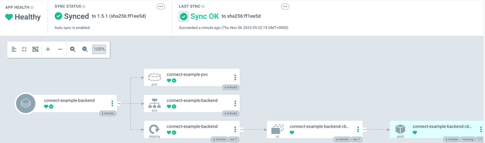
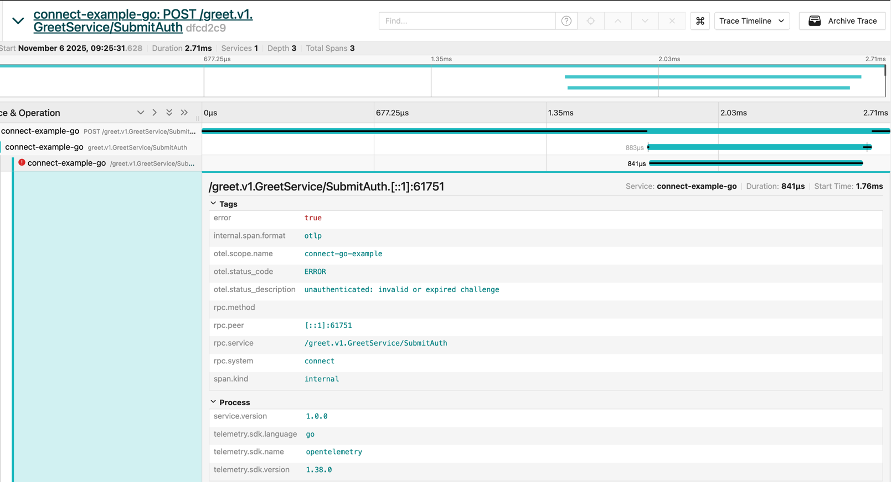
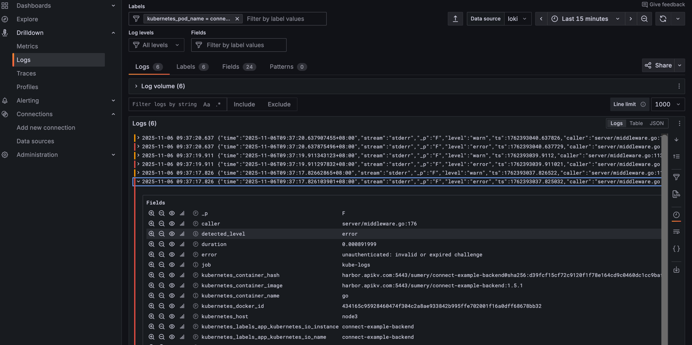

# Connect example

# Introduce
## Backend
1. 前沿技术栈
2. 参照了go-kratos的架构设计，参考了它对DDD的理解并应用本项目中，
3. 使用uber-fx带来更好的生命周期管理，
4. api统一通过protobuf来编写

## Frontend
1. 前沿技术栈
2. 完善的基础设施
3. 通过buf生成的pb直接与后端交互

## CI/CD
采用GitOps， 将应用测试，构建，部署集中到Github Actions中，实现自动化

## 可观测性
在应用部署之后可通过Web UI来查看应用的指标/日志/链路，来进行追踪，监控，优化

# Backend stack
- golang
- connect-go
- Buf
- Protobuf
- sqlc
- fx

# Frontend stack
- React
- TypeScript
- Connect-web
- Buf

# Protocols
- RPC

# Databases
- Postgres
- Redis

# 先决条件
1. 前端：Node.js >= 22
2. 后端：Golang >= go1.25.2
3. 数据库：Postgres
4. 缓存：Redis
5. 注册/发现：Consul

如果想体验完整项目，你还需安装:
1. Docker
2. Kubernetes
3. ArgoCD
4. Consul
5. cert-manager
6. OpenTelemetry
7. Victoria metrics
8. Grafana
9. Loki
10. Jaeger
11. fluent-bit

# 运行
## backend
```bash
docker compose -f backend/infrastructure/postgres up -d
docker compose -f backend/infrastructure/redis up -d
docker compose -f backend/infrastructure/consul up -d
```
修改`configs/config.yaml`为你的host地址:
```yaml
data:
  database:
    host: "192.168.3.105"
  redis:
    host: "192.168.3.114"
```

启动后端
```bash
make run
```

测试：
- api:
```bash
curl -v -X POST http://localhost:4000/greet.v1.GreetService/SubmitAuth \
--header 'Content-Type: application/json' \
--data-raw '{}'
```

- CI:


- CD:


- Register/discover:


- Trace:


- Log:


- Metrics


## Frontend
```bash
pnpm i
pnpm dev
```

测试：
```bash
curl -v http://localhost:3000
```
