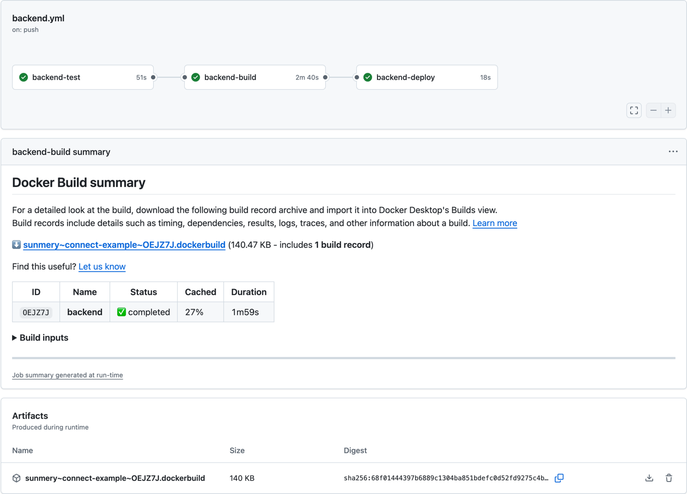
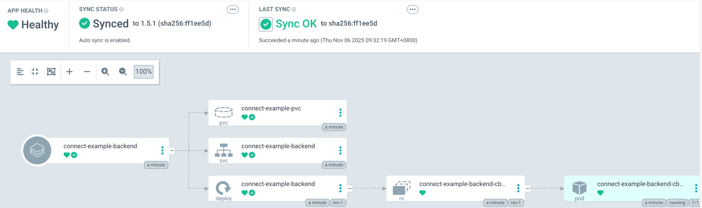
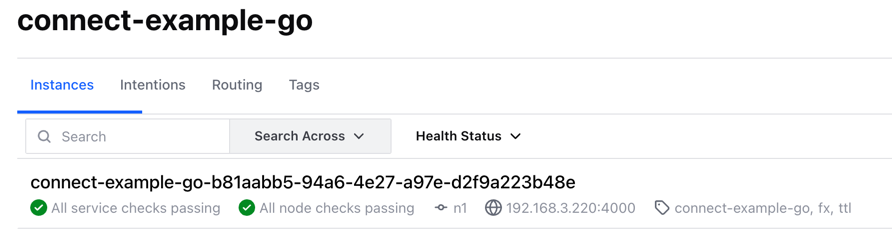
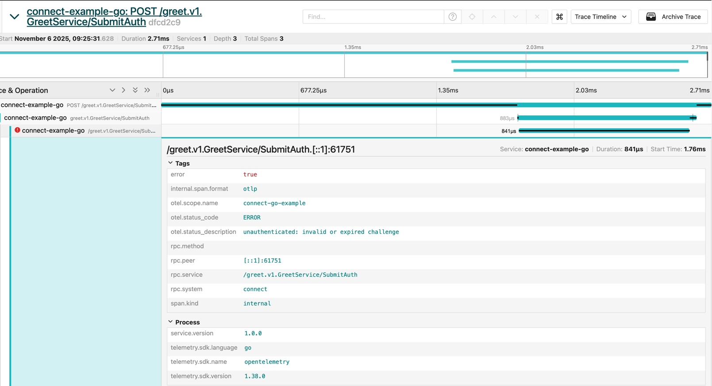
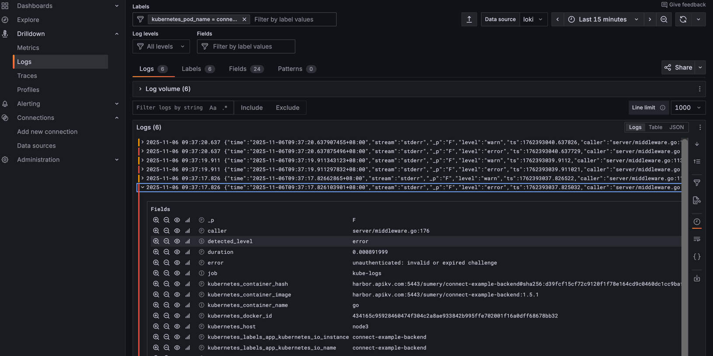
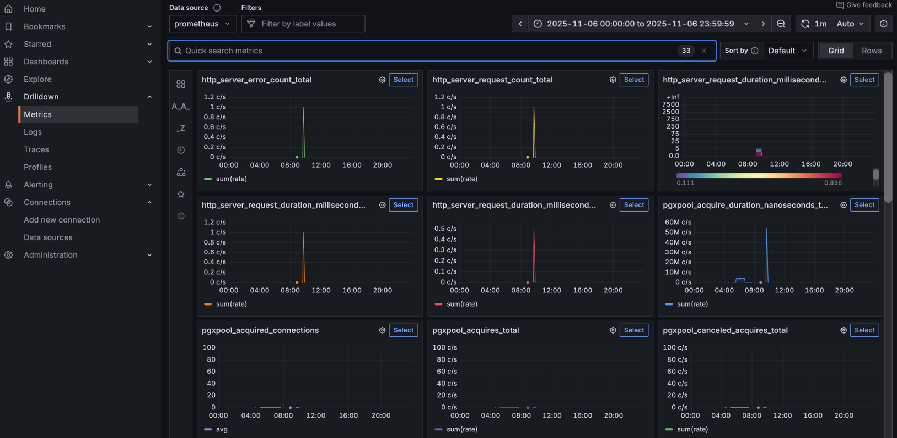

# Ecommerce — Go 微服务电商

[](LICENSE)     

Golang + React 的 B2B2C 多商家电商实践项目：10 个后端微服务、control-tower 平台控制面与 pnpm monorepo 前端。消费者端已有部分业务，商家端和管理端仍以骨架为主；当前没有独立物流端或仓储端，也没有百万/千万级容量验收结论。

本项目的组成使用(或部分使用)了本人其他的仓库：

1. 网关与配置控制面: https://github.com/lens077/control-tower （同级仓，gateway/config 已切流）
2. 云原生基础设施部署: https://github.com/lens077/cloud-native-deploy
3. 微服务开发脚手架: https://github.com/lens077/go-connect-template-cli
4. 微服务项目模板: https://github.com/lens077/go-connect-template

## 技术栈

| 领域 | 选型 |
|---|---|
| 后端 | Go、ConnectRPC Go、Protobuf/Buf、Protovalidate、Fx、pgx、sqlc、goose、OpenTelemetry |
| 前端 | React、TypeScript、ConnectRPC/Protobuf-ES、pnpm workspace、vite-plus（vp）、Tauri |
| 网关/配置 | [control-tower](https://github.com/lens077/control-tower)：BFF session + legacy JWT、Casbin RBAC、Connect 直通、Config Center；默认无重试、无 BBR/熔断/HTTP/3 |
| 数据 | node3 Pigsty PostgreSQL、Dragonfly（业务可丢缓存 + BFF session）、Meilisearch、Silo S3-compatible；CNPG 休眠，SeaweedFS 尚待迁移 |
| 事件 | PostgreSQL outbox + relay + NATS JetStream + search indexer；当前优先补 NATS R3、Inbox、NACK/DLQ、重放与容量/恢复证据，分析 CDC 仅在真实需求成立后评估 |
| 注册/配置 | Consul 仅做注册发现并待迁 K8s Service DNS；Config Center 是 10 个服务唯一 Bootstrap 来源 |
| 边缘/安全 | Cilium CNI/KPR/LB/Gateway API、cert-manager、ESO + Vault；业务服务的默认拒绝 NetworkPolicy 和 east-west 身份仍不完整 |
| 制品/交付 | Docker Buildx、TCR + GHCR 镜像、Harbor Helm OCI helper、Kubernetes manifest、Helm、GitHub Actions；ArgoCD 当前断线 |
| 可观测性 | OpenTelemetry、Vector、VictoriaMetrics/Logs/Traces、Grafana、vmalert、Alertmanager；外部告警通知仍未闭环 |
| 工程工具 | vite-plus、oxlint/oxfmt、Vitest/Playwright、Buf breaking、structcheck、verify-context/canary、commitlint |

架构要点（详见 [`docs/design/`](docs/design/README.md) 与 [`STACK.md`](STACK.md)）：

- **API 契约先行**：google protobuf 定义前后端交互，`@bufbuild/buf` 生成代码，每个字段带 `buf.validate` 约束
- **后端分层**参考 go-kratos：biz（领域结构体）→ data（DB/cache/search/event/object）→ service（proto 转换）→ server（fx 装配与注册发现）
- **入口能力集中**：BFF session/JWT、Casbin 授权、路由、超时与可信身份头由 control-tower gateway 处理；服务仍负责数据归属与领域权限
- **配置源与业务配置分离**：服务先读一份很小的 selector，再从 Config Center 取完整 `Bootstrap`；不存在 Consul KV 回退
- **交付实况**：GitHub Actions 按 semver tag 构建并双推 TCR/GHCR，再回写 Helm tag；ArgoCD 当前没有 Application，部署仍走 `backend/services/*/deploy/`
- **可观测性**：Vector 采容器日志，应用经 OTel SDK 输出三支柱；node3 的 VictoriaMetrics/Logs/Traces 与 Grafana 汇总查询
- **容量边界**：规模必须以固定数据集、k6 脚本、资源配额、延迟/错误率结果和故障恢复证据验收，当前未建立百万/千万级承诺

## 仓库结构

| 目录 | 内容 |
|---|---|
| `backend/` | 10 个微服务（user / product / cart / order / payment / inventory / search / address / merchant / behavior），`api/` 放 proto 契约，`structcheck/` 是结构性 CI 门禁 |
| `frontend/` | pnpm monorepo：4 app（consumer / merchant / admin / desktop）+ 9 共享包，见 [`frontend/README.md`](frontend/README.md) |
| `context/` | AI/团队三层知识库（团队级 / 框架级 / 服务级），入口 [`context/INDEX.md`](context/INDEX.md) |
| `helm/`、`argocd-*.yml` | 待修复的 Helm/GitOps 描述；当前部署实况以各服务 `deploy/` 为准 |
| `docs/` | 架构与领域设计（`docs/design/`，按微服务分目录）、可观测性方法论与看板脚本（`docs/observability/`）、agents 配置（`docs/agents/`）、历史评审归档（`docs/reviews/`） |
| `scripts/` | 验收锚点与门禁脚本（verify-quick / verify-context + canary / lint-baseline / harness-scars） |
| `.scratch/` | 进行中的 spec / issue（本地 markdown 工作流） |

> 网关与配置中心均由同级仓 control-tower 承载：本仓旧 `gateway/` 目录 2026-08-24 已删
> （历史在 tag `backup/pre-control-tower-20260823`），原 `backend/services/config/` 目录已删除。
> `.freeze/` 冻结验收集机制已于 2026-08-24 整套移除（恒绿假门禁，见 evolution-log）。

## 文档导航

| 文档 | 定位 |
|---|---|
| [`AGENTS.md`](AGENTS.md) | AI 协作入口：硬规则 + 验收锚点命令（**改代码前先读**） |
| [`docs/design/`](docs/design/README.md) | 架构与领域设计真相源：按微服务分目录（platform/product/order/…），含拆分与删章记录 |
| [`production-scale-goal.md`](docs/design/platform/production-scale-goal.md) | 百万/千万级生产化目标、现有技术栈边界、证据门禁、分阶段路线和完成定义 |
| [`STACK.md`](STACK.md) | 技术栈与工程约束：版本锁定、分层铁律、proto/sqlc 规则（真相源） |
| [`.service-matrix.yaml`](.service-matrix.yaml) | 服务拓扑事实表：注册名、网关前缀、依赖、Config Center 键（CI 强制对齐） |
| [`TODO.md`](TODO.md) | 实现进度真相源（当前实况以它为准） |
| [`docs/PRIORITY.md`](docs/PRIORITY.md) | 待办优先级排序（P0→P7，按最终目标）：**不是进度真相源**，只回答「先做哪个」，冲突以 `TODO.md` 为准 |
| [`docs/TECH-RADAR.md`](docs/TECH-RADAR.md) | CNCF Landscape 选型评估；新增基础设施必须由量化需求、容量或故障证据触发 |
| [`PRODUCT.md`](PRODUCT.md) / [`DESIGN.md`](DESIGN.md) | 产品定义与「灯市」视觉设计系统（配色/字体/间距 token），前端设计工作流（impeccable）的真相源——与已拆分的旧架构 DESIGN.md 同名不同物 |
| [`docs/DEVOPS.md`](docs/DEVOPS.md) / [`observability/OBSERVABILITY.md`](docs/observability/OBSERVABILITY.md) | DevOps 与可观测性的**目标态**设计 |
| [`docs/design/merchant/store-settings.md`](docs/design/merchant/store-settings.md) | Shopline 商店设置竞品调研；取舍与商家 MVP 路线见同目录 [`roadmap.md`](docs/design/merchant/roadmap.md) |
| 网关与配置面设计 | 已随代码迁至同级仓 control-tower（`../control-tower/docs/design/`），本仓不再保留副本 |
| [`docs/SCAFFOLD.md`](docs/SCAFFOLD.md) | 换领域复用本仓工程体系的新项目生成规范 |
| [`context/harness-framework/graph-engineering.md`](context/harness-framework/graph-engineering.md) | 多闭环 AI 工作流方法论（冻结节点 + 锚点命令） |

## 先决条件

1. Go >= 1.26（`backend/go.mod` 当前 1.26.5；网关在同级仓 control-tower）
2. 前端：Node.js >= 22、pnpm 11
3. 数据库：PostgreSQL 18（当前主库由 node3 Pigsty 承载）；Dragonfly 用于业务可丢缓存和 control-tower BFF session。领域锁、幂等键与库存真相必须锚定 PostgreSQL
4. 注册/发现：Consul（**定稿退役 → K8s Service DNS**，四步迁移见 TODO；迁移完成前运行仍需）

配置中心（同级仓 [control-tower](https://github.com/lens077/control-tower) 的 config 服务）是
10 个业务服务的**必需启动依赖**。Consul 只负责服务注册发现，不再存储 Bootstrap。

如果要体验完整环境，还需 Docker、Kubernetes、Cilium Gateway API、cert-manager、ESO/Vault，以及外置的 OpenTelemetry Collector、VictoriaMetrics、VictoriaLogs、VictoriaTraces、Vector、Grafana、vmalert 与 Alertmanager。ArgoCD 虽已安装，但当前没有 Application，不能作为部署前提。

## 运行

### 后端

```bash
docker compose -f backend/infrastructure/postgres/compose.yaml up -d
docker compose -f backend/infrastructure/redis/compose.yaml up -d
docker compose -f backend/infrastructure/consul/compose.yaml up -d
```

基础设施地址（PG、Dragonfly、Meilisearch、NATS、Kafka、对象存储等）配置在 Config Center，不在仓库 YAML——
要指向自己的中间件时改 Config Center 里对应服务的 Bootstrap 即可。

启动后端微服务（一把拉起全部服务可用 `backend/compose.yaml`）：

```bash
cd backend/services/<service>
make dev        # 读取被 gitignore 的 configs/source.dev.yaml，再从 Config Center 拉 Bootstrap
```

所有服务都由 `CONFIG_SOURCE_FILE` 指向 SDK selector，且 selector 的 `type` 必须是
`config_center`。selector 缺失、token 无效或远端 key 不存在时直接启动失败，不回退到
Consul KV。本地单测可显式使用 `CONFIG_SOURCE=file`。
>
> 配置 SDK 随 control-tower module 发布。升级使用 `go get github.com/lens077/control-tower@v0.x.y`；
> **`go mod tidy` 只增删依赖，不会主动升级已钉版本。**

### 配置中心（必需基础设施）

配置中心现由同级仓 [control-tower](https://github.com/lens077/control-tower) 的 `services/config` 承载；旧独立 config-center 仓已退役。集群 namespace 与 Deployment 仍保留 `config-center` 名称，但镜像已经是 `control-tower-config` / `control-tower-config-web`。

```bash
cd ../control-tower
scripts/dev-local.sh config   # 从集群 Secret 生成 0600 临时配置，退出即删除
make verify                   # build + buf lint + go vet + test -race
```

config 服务必须从本地文件或 Kubernetes Secret 自举，不能把自己的唯一启动配置放进自己。历史 Consul KV 已删除；`backend/tools/config-seed` 只保留为迁移/审计工具。

### 网关

网关代码也在 `../control-tower`。本地 gateway 使用 file resolver 和端口转发，避免 Consul 返回 Mac 无法路由的 Pod IP：

```bash
cd ../control-tower
scripts/dev-local.sh gateway
```

Web 登录经 `/auth/login → Casdoor → /auth/callback` 建立 httpOnly cookie session；Tauri 使用 session header；legacy 客户端迁移期仍可使用 bearer JWT。后端验证应优先经过 gateway，直连只用于明确的内部调试，不能用来证明生产安全边界。

### 前端

`frontend/` 是一个 pnpm workspace monorepo，4 个 app + 9 个共享包。
结构、分包原则、四层目录职责和工具链细节见 [`frontend/README.md`](frontend/README.md)。

| app        | 端口 | 说明                                     | 启动                |
| ---------- | ---- | ---------------------------------------- | ------------------- |
| `consumer` | 3000 | 商品/购物车/地址部分可用；下单/支付/库存闭环未完成 | `pnpm dev` |
| `merchant` | 3002 | 商家端路由与登录壳，业务 API 接线很少 | `pnpm dev:merchant` |
| `admin` | 3003 | 管理端路由与登录壳，业务 API 接线很少 | `vp run admin#dev` |
| `desktop` | — | Tauri 2 壳，可套 consumer 或 merchant | `pnpm desktop` / `pnpm desktop:merchant` |

共享包：`api`（Connect 传输层与拦截器）、`configs`、`constants`、`i18n`、
`perf`（Web Vitals 性能监控）、`tauri`（桌面端胶水）、`tracker`（行为埋点）、`ui`、`utils`。

```bash
cd frontend
pnpm i        # prepare 会跑 vp config 装 git 钩子（core.hooksPath 指向 frontend/.vite-hooks/_）
pnpm dev      # consumer，端口 3000
pnpm ready    # vp fmt && vp lint && vp run -r test && vp run -r build，提 PR 前跑它
```

工具链说明：vite-plus（`vp`）一个包同时提供 dev server、构建、测试(vitest)、lint(oxlint)、
格式化(oxfmt)、任务运行器和 git 钩子，所以没有 husky / biome / eslint / prettier；
提交信息由 frontend workspace 的 commitlint 校验，配置在 `frontend/commitlint.config.mjs`。

## 效果截图

- CI:
  
- CD:
  
- Register/discover:
  
- Trace:
  
- Log:
  
- Metrics:
  

## 开发工作流

- **提交规范**：Conventional Commits + 可选 gitmoji，commitlint + vite-plus 钩子强制；
  提交前按改动类型更新对应真相源（进度 → `TODO.md`）。见 `context/team/git-commit.md`
- **提交前验收锚点**（详见 [`AGENTS.md`](AGENTS.md)）：默认先跑 `scripts/verify-quick.sh`；修改服务矩阵再跑 `cd backend && go test -count=1 ./structcheck/...`；修改 context、设计索引或 STACK 再跑 `scripts/verify-context.sh`
- **跨仓变更**：网关/config 代码在 `../control-tower` 独立提交；路由模板与本仓 structcheck 契约必须同版本升级

## 贡献

欢迎通过 issue 反馈问题、通过 Pull Request 参与改进。

- **动手前先读 [`AGENTS.md`](AGENTS.md)**：硬规则 + 验收锚点，是本仓协作的地基。
- **改动流程**：fork → 建分支 → 修改 → 按改动类型跑通 `AGENTS.md` 的验收锚点 → 提 PR；默认入口是 `scripts/verify-quick.sh`。
- **改动前查真相源，别凭记忆**：技术栈与分层约束看 [`STACK.md`](STACK.md)、服务拓扑看
  [`.service-matrix.yaml`](.service-matrix.yaml)、架构设计看 [`docs/design/`](docs/design/README.md)；
  按改动类型更新对应真相源（进度 → `TODO.md`，拓扑 → matrix，设计 → `docs/design/`）。
- **提交信息**：遵循 Conventional Commits，gitmoji 可选但带了就必须与 type 相符，
  由 commitlint 强制（细则见 `context/team/git-commit.md`）。
- **文档与门禁变更**：修改 `context/`、`docs/design/README.md`、`STACK.md` 或门禁脚本后，运行 `scripts/verify-context.sh`；修改门禁本身再运行 canary。

## 许可

本项目采用 **[CC BY-NC-SA 4.0](https://creativecommons.org/licenses/by-nc-sa/4.0/)**
（署名—非商业性使用—相同方式共享）授权，详见 [`LICENSE`](LICENSE)：

- 可用于个人学习、技术交流与非营利研究；衍生作品须以相同或更严格的协议开源，并注明出处。
- **任何商业使用**（直接售卖、SaaS 集成、含付费内容或广告的平台等）须事先获得书面授权。
- 商业授权或闭源例外请联系版权方：<https://github.com/lens077>
